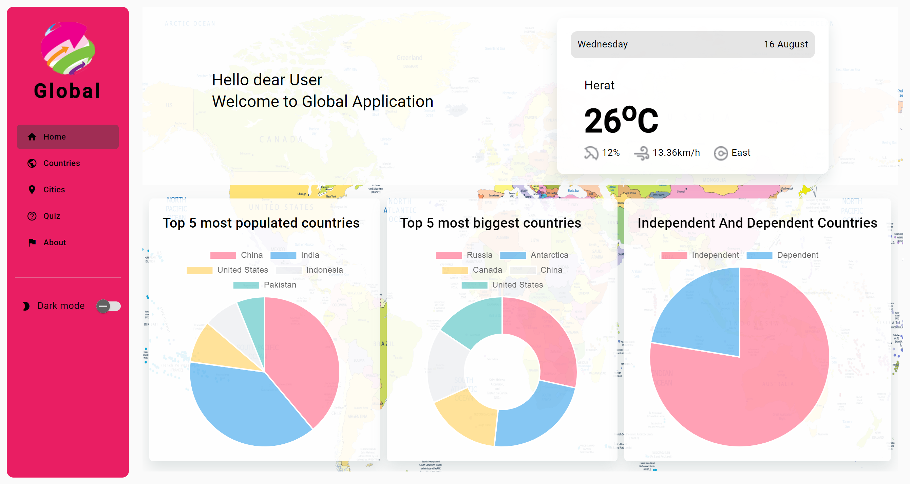
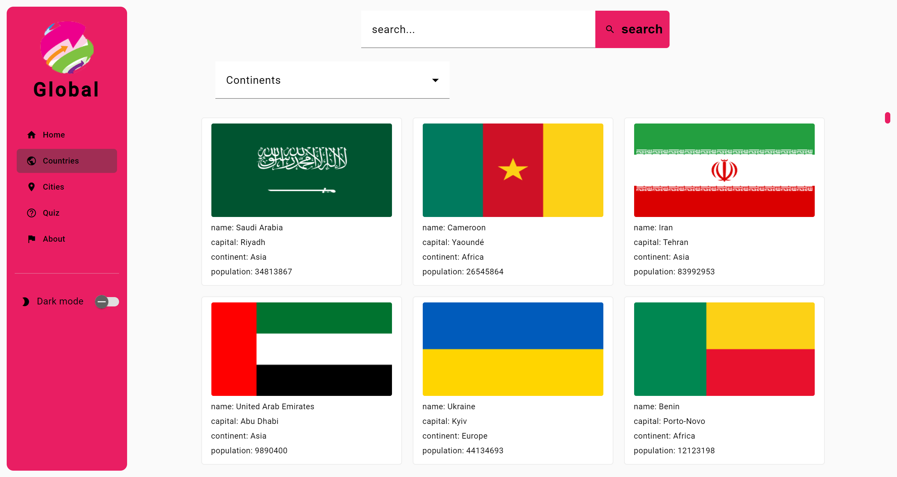

# Global

Global application provides valuable information about countires and cities. it uses diffrenet API for fetching data.
This application has been developed using Angular js v(16.1.0)

## Development server

Run `ng serve` for a dev server. Navigate to `http://localhost:4200/`. The application will automatically reload if you change any of the source files.

## Build

Run `ng build` to build the project. The build artifacts will be stored in the `dist/` directory.

